# Auth System — Complete Reference

> Assumes zero prior knowledge of this project. Read top to bottom.

---

## Overview

Auth is split across three layers:

| Layer | What it does | Where it lives |
|---|---|---|
| **Firebase Web SDK** (client) | Authenticates user, holds ID token, auto-refreshes it | `src/features/auth/lib/` |
| **Server Actions** (bridge) | Exchanges Firebase ID token for an `__session` HTTP-only cookie | `src/features/auth/actions/session.ts` |
| **Firebase Admin SDK** (server) | Verifies session cookie on every request, owns the `__session` cookie | `src/server/adapters/firebase/auth/` |

**Key invariant:** the browser never holds a Firebase ID token for auth purposes — only the short-lived token used to mint the `__session` cookie. All real session state lives in the `__session` HTTP-only cookie, invisible to JavaScript.

---

## Architecture — High-Level Flow

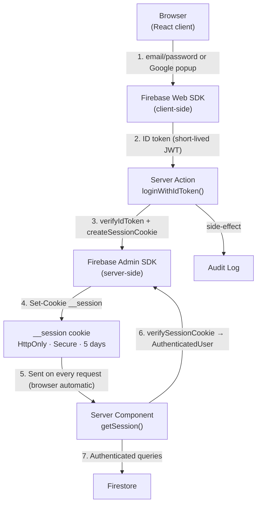

---

## Sign-In — Sequence Diagrams

### Email & Password Login

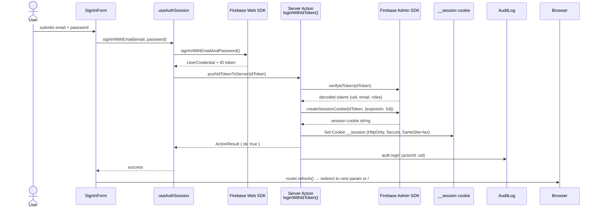

### Google OAuth Login

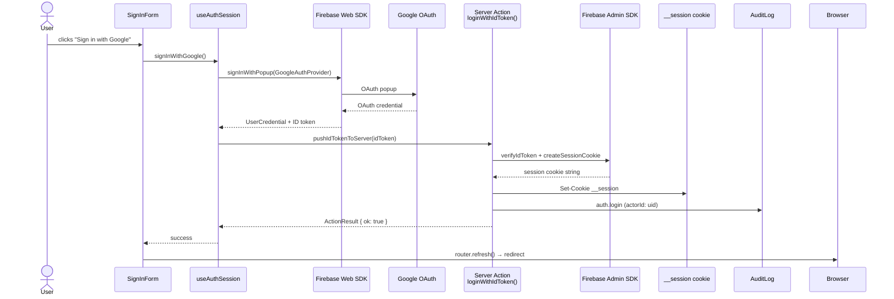

---

## Sign-Up (Registration)

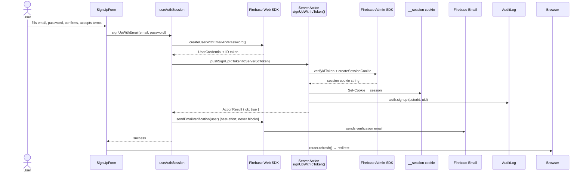

> **Note:** `sendEmailVerification` failures are silently swallowed — signup always succeeds even if the verification email fails.

---

## Logout

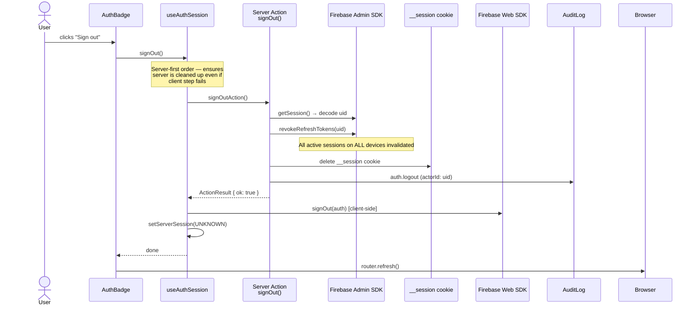

---

## Session Persistence & Token Refresh

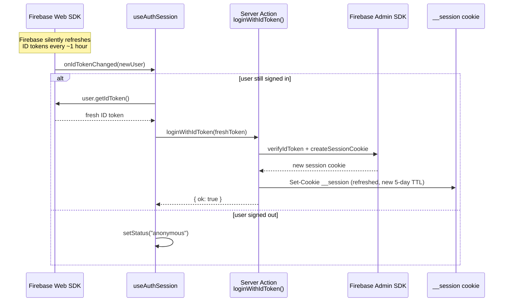

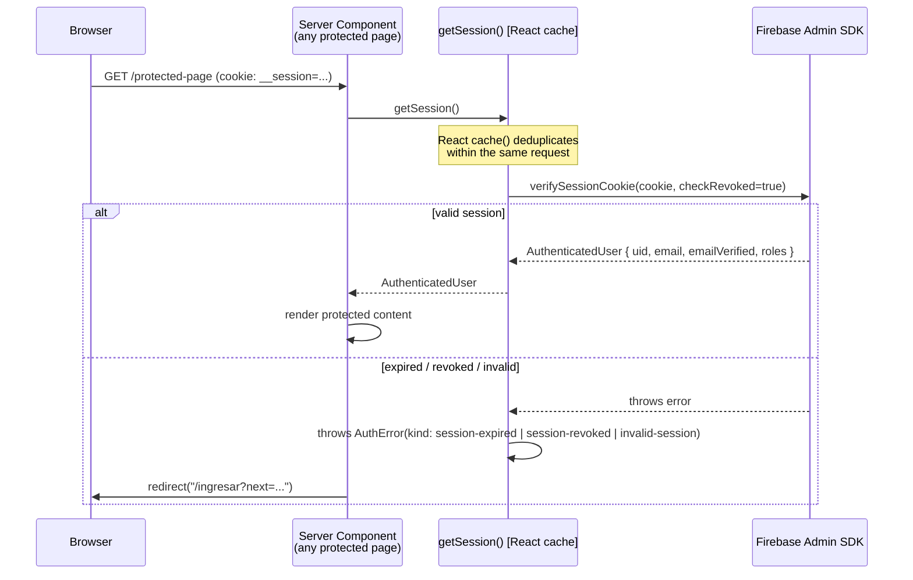

---

## Password Recovery

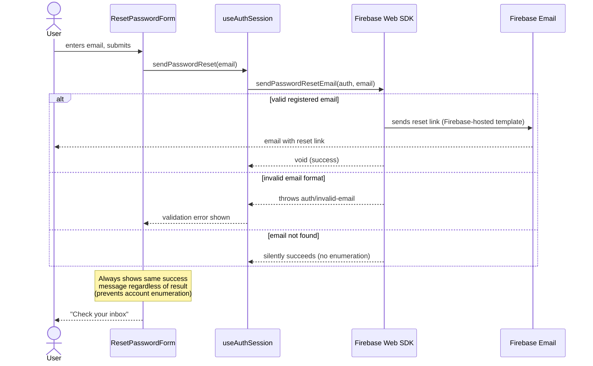

---

## Route Protection

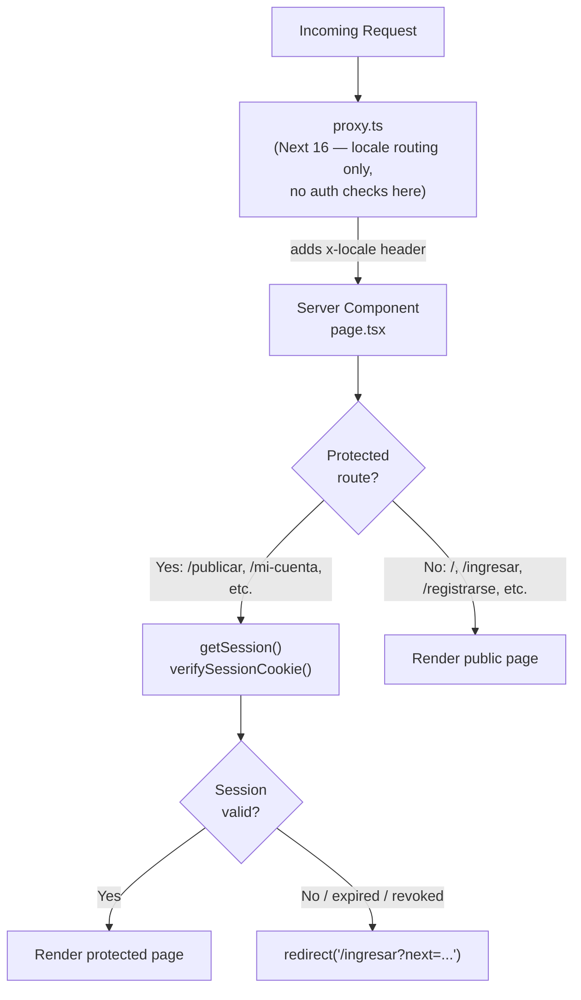

### Currently protected routes

| Route | How protected |
|---|---|
| `/[lang]/publicar` | `getSession().catch(() => null)` → redirect if null |
| `/[lang]/mi-cuenta` | `getSession().catch(() => null)` → redirect if null |
| Any Server Action | `requireAuth()` throws `AuthError("no-session")` if no cookie |

> `proxy.ts` handles **locale routing only** — it does not block unauthenticated requests. Auth checks happen at the Server Component level.

---

## Email Verification

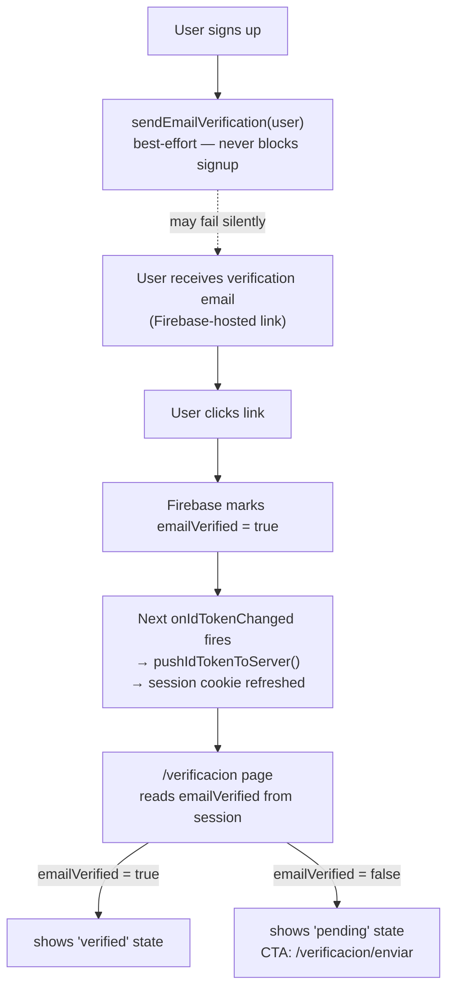

---

## Role System

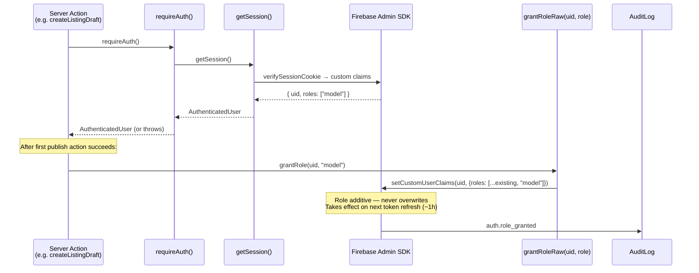

---

## File Map

```
src/
├── features/auth/
│   ├── actions/
│   │   └── session.ts              ← Server Actions: loginWithIdToken, signUpWithIdToken, signOut
│   ├── components/
│   │   ├── SignInForm.tsx           ← Email/password + Google sign-in UI
│   │   ├── SignUpForm.tsx           ← Registration UI with password strength meter
│   │   ├── ResetPasswordForm.tsx   ← Password recovery UI
│   │   └── AuthBadge.tsx           ← Header badge: sign-in / avatar + sign-out
│   └── lib/
│       ├── use-auth-session.ts     ← Main auth hook (status, user, all auth methods)
│       └── firebase-client.ts     ← Firebase Web SDK singleton (lazy init)
│
├── server/adapters/firebase/auth/
│   ├── index.ts                    ← Barrel export (getSession, createSession, destroySession, grantRoleRaw)
│   ├── manage-session.ts           ← createSession() + destroySession() — owns __session cookie
│   ├── verify-session.ts           ← getSession() — verifies cookie on every request (React cache'd)
│   └── grant-role.ts              ← grantRoleRaw() — sets Firebase custom claims
│
├── server/security/
│   └── require-auth.ts             ← requireAuth() — throws AuthError if no valid session
│
├── core/config/
│   ├── firebase.ts                 ← Server env vars (FIREBASE_PROJECT_ID, FIREBASE_PRIVATE_KEY…)
│   └── firebase-client.ts         ← Public env vars (NEXT_PUBLIC_FIREBASE_API_KEY…)
│
└── server/mocks/auth/
    └── index.ts                    ← Mock adapter when Firebase not configured (local dev)

src/app/[lang]/
├── ingresar/page.tsx               ← /login route
├── registrarse/page.tsx            ← /register route
├── recuperar/page.tsx              ← /password-reset route
├── verificacion/page.tsx           ← /email-verification status route
├── publicar/page.tsx               ← Protected: redirect if not authenticated
└── mi-cuenta/page.tsx              ← Protected: redirect if not authenticated

proxy.ts                            ← Next 16 proxy (locale routing only — no auth)
```

---

## Cookie Spec

| Property | Value |
|---|---|
| Name | `__session` |
| HttpOnly | `true` |
| Secure | `true` (production), `false` (dev) |
| SameSite | `lax` |
| Path | `/` |
| Max-Age | 5 days (432 000 s) |
| Set by | `src/server/adapters/firebase/auth/manage-session.ts` |
| Read by | `src/server/adapters/firebase/auth/verify-session.ts` |
| Deleted by | `destroySession()` + `revokeRefreshTokens(uid)` on logout |

---

## Sign-In Methods

| Method | Status |
|---|---|
| Email + Password | Enabled |
| Google OAuth (popup) | Enabled |
| Apple, Facebook, etc. | Not configured |

---

## Security Properties

- **No ID token in browser storage** — Firebase SDK holds it in memory; the browser only persists the `__session` cookie.
- **Cookie is HttpOnly** — XSS cannot read it.
- **Revocation on logout** — `revokeRefreshTokens(uid)` invalidates all sessions on all devices immediately.
- **`checkRevoked: true`** on `verifySessionCookie` — detects revoked tokens on every request (1 network call to Firebase, cached per request via React `cache()`).
- **No account enumeration** — password reset always shows the same success message.
- **Audit log** on every auth event (`auth.login`, `auth.signup`, `auth.logout`, `auth.role_granted`).
- **Mock adapter** — when `FIREBASE_*` env vars are absent, all auth functions return safe no-ops (local dev without Firebase).
